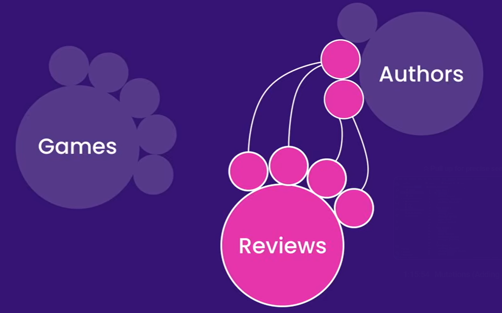
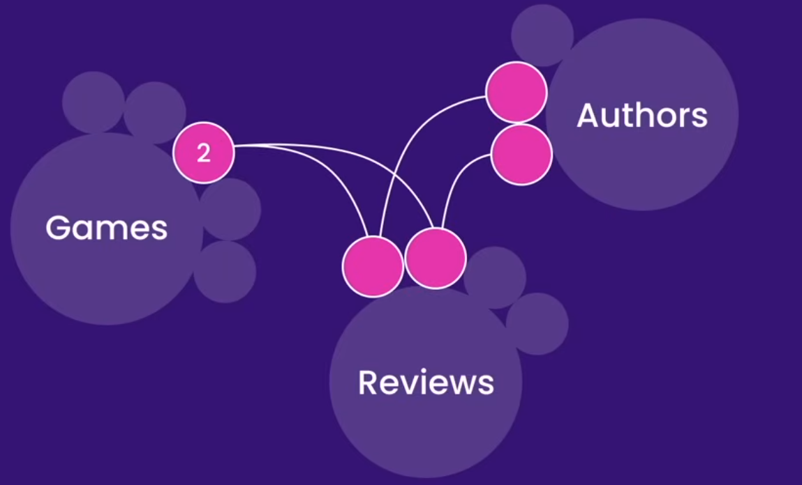

# GraphQL Learning Notes

## Why do we need GraphQL?

GraphQL is a **query language** for APIs, and a runtime for fulfilling those queries with existing data.

**Over-fetching** is when you request more data than you need.

**Under-fetching** is when you request less data than you need.

GraphQL solves both of these problems by allowing you to **request exactly the data you need**. 

It has a single endpoint, unlike REST which has multiple endpoints.

```GraphQL
# single endpoint
mygraphqlsite.com/graphql

# GraphQL
Query {
  courses {
    id,
    title,
    thumbnail_url
  }
}

# get nested data
Query {
    course(id: 1) {
        id,
        title,
        thumbnail_url,
        author {
            name,
            id,
            courses {
                id,
                title,
                thumbnail_url
            }
        }
    }
}

# REST
GET /courses
```

## How to make a query from the front end?

```GraphQL
query ReviewsQuery{ # query name
  reviews { # resource
    rating, # field
    content, 
    id, 
    author { # nested resource
      name, # nested field
      id,
      verified
    }
  }
}
```
Reviews and Authors are two resources but we only need to make one query for the nested data.




```GraphQL
Query {
  game(id: "2") {
    title,
    review {
        rating,
        author {
            name
        }
    }
  }
}
```



One query for nested data from 3 different resources

```GraphQL
query ReviewsQuery{ # query name
  reviews { # resource
    rating, # field
    content, 
    id, 
    author { # nested resource
      name, # nested field
      id,
      verified,
      reviews {
        rating,
        id,
        game {
          title
        }
      }
    }
    game {
      title,
      platform
    }
  }
}
```

## What is a Schema?

A **schema** is a collection of **types** that define the shape of your data.   

## What is a Type?

A **type** is a collection of **fields** that define the shape of your data.       

## What is a Field?

A **field** is a specific piece of data that you can request from a type.   

## What is a Query?

A **query** is a request for data from a schema.   

## What is a Mutation?

A **mutation** is a request to modify data in a schema.   

## What is a Subscription?

A **subscription** is a request to receive real-time updates from a schema.   

## What is a Resolver?

A **resolver** is a function that is called to fetch the data for a specific field.         


